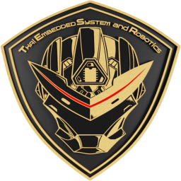

<div align="center">



# TESR ROI Studio

**Draw regions, lines and zones on a camera view. Read the values in your browser. Export Python that runs on the edge device.**

No install · no server · nothing leaves your machine

[**Open the tool →**](https://tesr-channel.github.io/AI_ROI_Designer/)

*[ภาษาไทยด้านล่าง](#ภาษาไทย)*

</div>

---

## What it does

Point a camera at a machine, a tank, a doorway or a conveyor, mark what you care about, and get a working Python program back.

| Shape | Task | Example | Model needed? |
|---|---|---|---|
| Box | `digits_7seg` | Read a 7-segment or LCD panel on a machine | No |
| Box | `ocr_text` | Read printed text or numbers | No |
| Box | `barcode_qr` | QR, Code 128, Code 39, EAN-13, UPC-A, EAN-8, ITF | No |
| Box | `color_check` | Tower light, status lamp, part colour | No |
| Box | `presence_diff` | Something appeared, moved or went missing | No |
| Box | `yolo_detect` / `yolo_classify` | Your own trained model, per region | Yes |
| Line | `level_line` | Water level in a tank, silo or sight glass | No |
| Line | `measure_line` | Part width, gap, any dimension in millimetres | No |
| Line | `line_count` | People in and out, vehicles, parts passing — with direction | Yes |
| Zone | `zone_count` | How many things are inside an area right now | Yes |

Each region publishes its own value. One camera can do several jobs at once.

---

## Getting started

**Use it now:** open the link above, or download `index.html` and double-click it. Everything works offline except the first use of an `.onnx` model or OCR, which fetches an engine.

**Run it for real:**

```bash
pip install opencv-python numpy
python tesr_vision_runner.py --config your_config.json --test
```

Press **Export config + Python** in the tool and you get the config plus the runner, ready to go.

Try the bundled examples first:

```bash
cd runner
python tesr_vision_runner.py --selftest
python tesr_vision_runner.py --config ../examples/demo_config.json --once
python tesr_vision_runner.py --config ../examples/meters_grouped.json --once --auto-group
```

---

## Where the values go

Console · CSV · JSONL · MQTT (straight into Node-RED) · HTTP webhook · a snapshot image when a value changes.

A value is only published once it has read the same result `stable_frames` times in a row, so a display mid-change never leaks a wrong number downstream.

---

## Repository layout

```
index.html                    the whole tool, one self-contained file
runner/
  tesr_vision_runner.py       reads a config and runs it on a real camera
  tesr_line_engine.py         level, dimension, line counting, zone counting
  requirements.txt
examples/                     configs and images you can run immediately
```

Both Python files are also embedded in `index.html`, so the export button hands them to you without cloning anything.

---

## Runs where you need it

Windows · macOS · Linux · Raspberry Pi · NVIDIA Jetson · mini and industrial PCs

`.onnx` models run on `onnxruntime` alone — no Ultralytics, no PyTorch. About 50 MB instead of 2 GB, which is the difference between a Pi working and a Pi not.

```bash
yolo export model=best.pt format=onnx opset=12    # from Ultralytics
pip install onnxruntime                            # on the device
```

Barcode and QR decoding is built into both sides. `pyzbar` and `libzbar0` are not required.

---

## Honest limits

Please read these before quoting a customer.

- **Accuracy is a property of the installation, not the software.** Lighting, camera angle, distance and display quality decide it. Any figure quoted before testing on site is an estimate.
- **Glare on a machine's display glass is the single most common cause of a wrong reading.** Tilt the camera 10–20° off the reflection and fit a shade hood.
- **If the camera moves after installation, the regions must be redrawn.** Design the mount to lock its position.
- **Measurement figures in the documentation come from synthetic test images** where everything is controlled. Real installations have perspective and lens distortion. Establish real accuracy by measuring a known standard part on site.
- **Counting quality depends mostly on your detector model.** The tracker and crossing logic are tested against scripted paths; the detections they consume are yours.
- **The browser preview is a tuning aid.** Confirm the real value with Python on the target device.

The tool is built to **fail to read** rather than **read wrong**. Every barcode format is checksum-validated, measurements are rejected when the image does not support them, and a joined multi-digit reading is withheld if any digit is unclear. A missing value is an inconvenience; a confidently wrong value in a production database is a much worse problem.

---

## Privacy

Camera frames, uploaded images and model files **never leave the machine**. Models are stored in that browser's IndexedDB. The only network requests are for the ONNX and OCR engines, on first use of those features.

---

## Publishing your own copy

1. Upload this repository to GitHub
2. **Settings → Pages → Source**, choose **GitHub Actions**
3. Push to `main`; the included workflow deploys in about a minute

Update the link at the top of this file to your own Pages URL.

---

## Documentation

Full guides, including field troubleshooting and the auto-tune workflow:

- [English](README.en.md)
- [ภาษาไทย](README.th.md)

---

## Licence

MIT — see [LICENSE](LICENSE). Bundled and CDN components are listed in [THIRD_PARTY.md](THIRD_PARTY.md).

---

<a name="ภาษาไทย"></a>

# ภาษาไทย

**ตีกรอบ ลากเส้น หรือวาดพื้นที่บนภาพจากกล้อง อ่านค่าได้ทันทีในเบราว์เซอร์ แล้วส่งออกเป็น Python ที่รันบนเครื่องปลายทางได้จริง**

ไม่ต้องติดตั้ง ไม่ต้องรันเซิร์ฟเวอร์ ไม่มีภาพหรือโมเดลถูกส่งออกจากเครื่อง

หน้าเว็บมีทั้งภาษาไทยและอังกฤษ สลับได้ที่ปุ่ม TH / EN มุมบนขวา

## ใช้ทำอะไรได้

| รูปทรง | งาน | ตัวอย่าง | ต้องมีโมเดลไหม |
|---|---|---|---|
| กรอบ | อ่านตัวเลข 7-segment | อ่านค่าจากจอเครื่องจักร | ไม่ต้อง |
| กรอบ | OCR | อ่านข้อความหรือตัวเลขทั่วไป | ไม่ต้อง |
| กรอบ | Barcode / QR | QR, Code 128, Code 39, EAN-13, UPC-A, EAN-8, ITF | ไม่ต้อง |
| กรอบ | ตรวจสี | ไฟหอคอย ไฟสถานะ สีชิ้นงาน | ไม่ต้อง |
| กรอบ | ตรวจการเปลี่ยนแปลง | มีของมาวาง ของหาย ของขยับ | ไม่ต้อง |
| กรอบ | YOLO | โมเดลที่คุณเทรนเอง แยกตามกรอบ | ต้องมี |
| เส้น | วัดระดับ | ระดับน้ำในถัง ไซโล หลอดวัดระดับ | ไม่ต้อง |
| เส้น | วัดขนาด | ความกว้างชิ้นงาน ระยะห่าง เป็นมิลลิเมตร | ไม่ต้อง |
| เส้น | นับข้ามเส้น | นับคนเข้าออก นับรถ นับชิ้นงาน แยกทิศทาง | ต้องมี |
| พื้นที่ | นับในพื้นที่ | มีกี่คน กี่ชิ้น อยู่ในพื้นที่ตอนนี้ | ต้องมี |

## เริ่มใช้

เปิดลิงก์ด้านบน หรือดาวน์โหลด `index.html` แล้วดับเบิลคลิก ทำงานออฟไลน์ทั้งหมด ยกเว้นตอนใช้โมเดล `.onnx` หรือ OCR ครั้งแรกที่ต้องดึงเอนจิน

รันจริงบนเครื่องปลายทาง

```bash
pip install opencv-python numpy
python tesr_vision_runner.py --config your_config.json --test
```

ลองไฟล์ตัวอย่างก่อนได้

```bash
cd runner
python tesr_vision_runner.py --selftest
python tesr_vision_runner.py --config ../examples/demo_config.json --once
```

## ข้อจำกัดที่ต้องบอกลูกค้าตรง ๆ

- **ความแม่นยำขึ้นกับการติดตั้ง ไม่ใช่ซอฟต์แวร์** แสง มุมกล้อง ระยะ และความคมชัดของจอเป็นตัวตัดสิน ตัวเลขใด ๆ ก่อนทดสอบหน้างานถือเป็นค่าประมาณ
- **แสงสะท้อนบนกระจกหน้าจอคือสาเหตุอันดับหนึ่งที่อ่านผิด** เอียงกล้อง 10–20° ให้พ้นมุมสะท้อน ใส่ฮูดบังแสง
- **ถ้ากล้องขยับหลังติดตั้ง ต้องตีกรอบใหม่** ควรออกแบบขายึดให้ล็อกตำแหน่ง
- **ตัวเลขความแม่นยำในเอกสารวัดจากภาพสังเคราะห์** หน้างานจริงมี perspective และเลนส์บิดเบี้ยว ต้องวัดกับชิ้นงานมาตรฐานที่หน้างานเอง
- **คุณภาพการนับขึ้นกับโมเดลตรวจจับของคุณเป็นหลัก**

ระบบออกแบบให้ **อ่านไม่เจอ** ดีกว่า **อ่านผิด** บาร์โค้ดทุกฟอร์แมตตรวจ checksum การวัดจะปฏิเสธเมื่อภาพไม่ดีพอ และตัวเลขหลายหลักที่รวมกันจะไม่ถูกส่งออกถ้ามีหลักใดอ่านไม่ชัด เพราะค่าที่หายไปแค่สร้างความไม่สะดวก แต่ค่าที่ผิดในฐานข้อมูลการผลิตเป็นปัญหาที่ใหญ่กว่ามาก

---

<div align="center">

**TESR Co., Ltd. — Thai Embedded Systems and Robotics**

Build, Train and Deploy AI to Edge Devices

</div>
